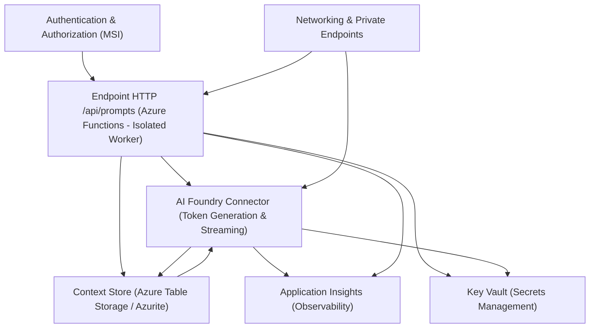

# 🤖 LeIA - AI-Powered Assistant (Azure Serverless)

**LeIA** is a scalable, enterprise-grade intelligent assistant built on a **Serverless Architecture** using Microsoft Azure. This project implements real-time token streaming and automated session context management.

## 🏗️ System Architecture

The solution follows cloud-native patterns to ensure high availability, security, and low latency.

### 📊 Logical Flow
Below is the architectural flow designed for this project, representing the interaction between the Azure Function, AI Foundry, and Storage layers.

  📸 Interface & User Experience
The frontend is a responsive chat interface that consumes the Server-Sent Events (SSE) stream from the backend.

Figure 1: Real-time token streaming and UI responsiveness.

🛠️ Key Components & Technologies
Backend Engineering
Azure Functions (.NET 8 Isolated Worker): High-performance ingestion layer using the latest isolated process model.

C# / .NET 8: Strongly typed logic ensuring reliability and clean architecture.

AI & Data Management
AI Foundry (GPT-4o/mini): Optimized connectors for generating high-quality AI responses.

Azure Table Storage: Partitioned by sessionId for efficient and cost-effective context persistence.

Figure 2: Session history being persisted in Azure Table Storage.

🛡️ Security & Governance
Security was a priority in this architecture, following Kumulus's high standards for enterprise solutions:

Secret Management: All sensitive data (API Keys) are stored in Azure Key Vault.

Managed Identity (MSI): Passwordless authentication between services.

Data Governance: Implemented logic for data retention and PII masking.
